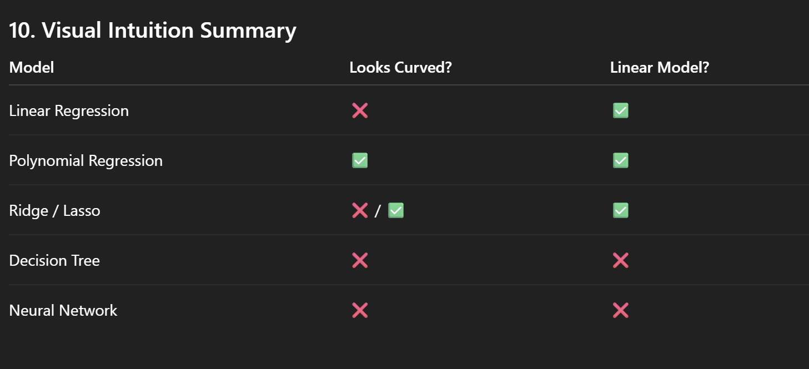

# Regression Algorithms — A Clear Mental Map
---

## 1. What Does *Linear* vs *Non-Linear* Actually Mean?

In Machine Learning, **linear vs non-linear does NOT mean the graph shape**.

###  Correct definition:
A model is **linear** if it is **linear in its parameters (weights)**.

###  Incorrect definition:
- Linear = straight line  
- Non-linear = curved line  

That definition is **wrong in ML**.

---

## 2. Linear Regression (The Base Model)

### Model equation:
y = w₀ + w₁x

- Linear in parameters `w₀`, `w₁`
- Straight-line relationship
- Simple, interpretable
- Can underfit complex data

✔ **This is a linear model**

---

## 3. Polynomial Regression

### Model equation:
y = w₀ + w₁x + w₂x² + w₃x³


### Key insight:
- The curve is **non-linear in x**
- But the model is **linear in parameters (w₀, w₁, w₂, w₃)**

✔ **Polynomial Regression is STILL a LINEAR MODEL**

> It is solved using the **same math as Linear Regression**  
> (OLS or Gradient Descent)

---

## 4. Why Polynomial Regression Is Still Linear

Look at the parameters:

y = w₀·1 + w₁·x + w₂·x²

This is just:  y = w · φ(x)


Where `φ(x)` is a **feature transformation**, not a model change.

---

## 5. What sklearn's `PolynomialFeatures(degree)` REALLY Does

### Important truth:
`PolynomialFeatures` is **NOT a model**

It is a **feature transformer**.

### Example:
Original feature:

X = [x]

After:
```python
PolynomialFeatures(degree=3)

Transformed Feature:
[1, x, x², x³]

Then you apply LinearRegression on this expanded feature space.


X → PolynomialFeatures → LinearRegression

Model is still Linear Regression
```
---

### 6. Linear Models (Linear in Parameters)

These models are all linear, even if the curve bends.

Core Linear Models

|Model	          |Linear in Parameters?|	Curve Shape|
|-------------|-------------|
|Linear Regression| Yes  | Straight line |
|Polynomial Regression	| Yes	|Curved|
|Ridge Regression	| Yes	|Straight / Curved|
|Lasso Regression	| Yes	|Straight / Curved|
|Elastic Net	| Yes	|Straight / Curved|


* Regularization changes loss function, not model type

---

### 7. Truly Non-Linear Regression Models

These models are non-linear in parameters.

Non-Linear Models

|Model  |Why Non-Linear|
|---------|-----------|
|Decision Tree Regression|	Rule-based splits|
|Random Forest	|Ensemble of trees|
|Gradient Boosting|	Sequential trees|
|KNN Regression	|Distance-based|
|Neural Networks|	Non-linear activations|
|SVR (RBF kernel)|	Kernel trick|


## If the model is linear in weights → it is a Linear Model

* Even if:

    - The curve is bent
     
    - Features are transformed

    - Polynomial terms are added

