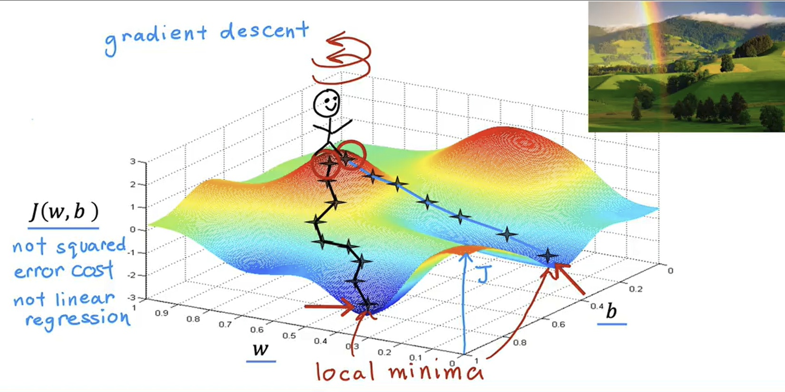
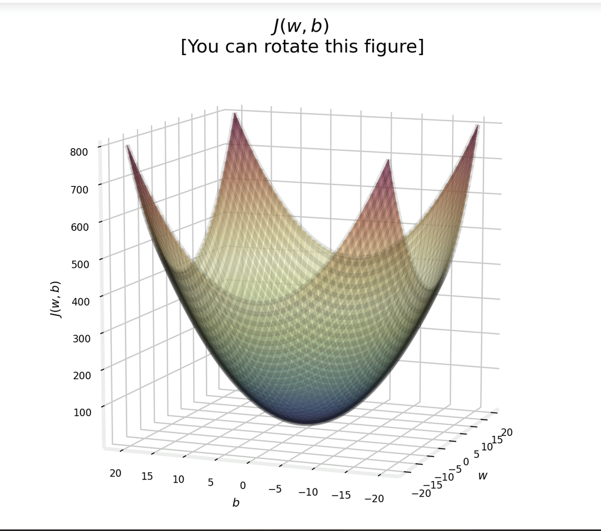
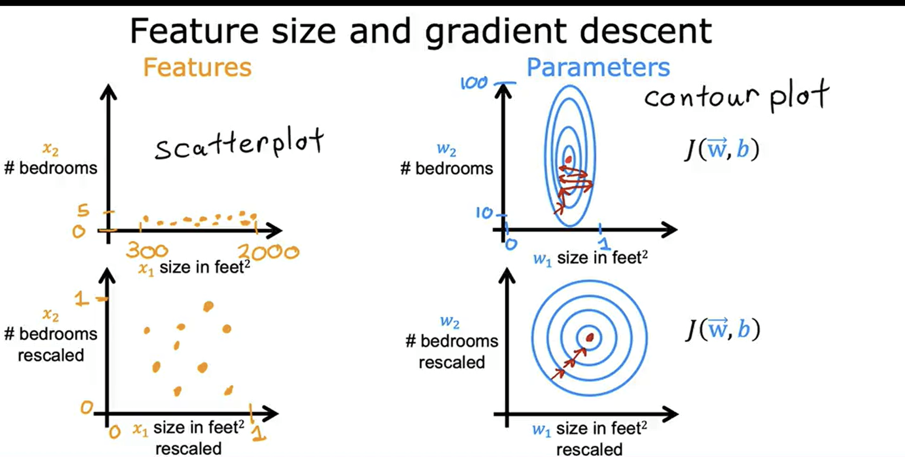

# Intro to Gradient in Machine Learning

---

---

## 1. What is a Gradient?

### The simplest possible meaning

A **gradient tells you how a quantity changes when you change inputs**.

In Machine Learning, there are always two things:
- Something we can control → **model parameters (weights, bias)**
- Something we want to improve → **loss (error)**

So in plain English:

> **Gradient tells us how the loss will react if we slightly change each parameter.**

---

### Think before math (important)

Imagine training without gradients.

You change a weight, the loss changes… but you don’t know:
- Was this change helpful or harmful?
- Should I increase this weight more or decrease it?

Without this information, learning becomes guesswork.

The **gradient removes guessing**.

---

### Everyday intuition

Think of adjusting a radio:
- One knob changes sound a lot
- Another barely changes anything

Those sensitivities **are gradients**.

---

## 2. Why Gradient Matters in ML

Machine Learning is essentially:

> **Finding parameters that minimize loss**

But:
- We cannot guess good parameters
- We need a *systematic direction*

The gradient provides that direction.

---

## 3. Loss Function (Core Target)

Examples:
- Linear Regression → Mean Squared Error
- Logistic Regression → Log Loss
- Neural Networks → Cross Entropy

Example (MSE):

$$
J(w,b) = \frac{1}{n} \sum (y - (wx + b))^2
$$

The **gradient of J** tells us how to change `w` and `b` to reduce error.

---

## 4. Gradient Descent: Turning Information into Learning

Gradient Descent is a **method of learning from mistakes**.

Training loop:
1. Predict
2. Measure loss
3. Compute gradient
4. Update parameters
5. Repeat

Update rule:

$$
\theta := \theta - \alpha \nabla J(\theta)
$$

---

## 5. Learning Rate (α)

Learning rate controls **step size**.

- Too small → slow learning
- Too large → divergence
- Just right → fast convergence

Rule of thumb:
- Start with `0.01` or `0.001`

---

## 6. Types of Gradient Descent

### 6.1 Batch Gradient Descent
Uses entire dataset.

$$
\nabla J = \frac{1}{n} \sum_{i=1}^n \nabla J_i
$$

---

### 6.2 Stochastic Gradient Descent (SGD)

Uses one data point.

$$
\theta := \theta - \alpha \nabla J_i
$$

---

### 6.3 Mini-Batch Gradient Descent

Uses small batches (32–256).  
**Industry standard.**

---

## 7. Gradient in Linear Regression

Loss:

$$
J(w,b) = \frac{1}{n} \sum (y - y_{pred})^2
$$

Gradients:

$$
\frac{\partial J}{\partial w} = -\frac{2}{n} \sum x(y - y_{pred})
$$

$$
\frac{\partial J}{\partial b} = -\frac{2}{n} \sum (y - y_{pred})
$$

---

## 8. Vectorized Gradient Descent

Vectorized gradient:

$$
\nabla w = \frac{1}{n} X^T(Xw - y)
$$

Why vectorization:
- Faster
- GPU friendly
- Cleaner code

---

## 9. Cost Surface & Geometry

- 1 parameter → curve
- 2 parameters → bowl
- Many → high-dimensional surface

Gradient → **steepest ascent**  
Gradient descent → **steepest descent**

---

## 10. Problems with Basic Gradient Descent

- Local minima
- Saddle points
- Vanishing gradients

---

## 11. Improved Gradient-Based Optimizers

- Momentum
- AdaGrad
- RMSProp
- Adam (default)

Adam = momentum + adaptive learning rate.

* more detailed info below

---

## 12. Gradient vs Derivative

| Concept | Meaning |
|------|--------|
| Derivative | Single variable change |
| Partial Derivative | Change w.r.t one variable |
| Gradient | Vector of partial derivatives |

---

## 13. When Gradient Does Not Work

- Non-differentiable loss
- Discrete optimization

Alternatives:
- Reinforcement Learning
- Genetic Algorithms

---

## 14. Mental Model

- Loss → height
- Gradient → slope
- Learning rate → step size
- Training → walking downhill

---

## 15. Final Summary

- Gradient = direction
- Gradient Descent = learning process
- Learning rate controls speed
- Mini-batch GD is standard

If you understand gradients, **you understand ML training**.

---

## 16. Improved Gradient-Based Optimizers

### Why basic Gradient Descent struggles

Plain Gradient Descent uses:
- **One global learning rate** for all parameters
- **Same update rule** everywhere in the loss surface

But real-world loss surfaces are:
- Highly **curved**
- **Noisy** (especially with mini-batches)
- **Uneven** — steep in some directions, flat in others

Because of this, basic Gradient Descent often:
- Converges very slowly
- Oscillates near the minimum
- Is extremely sensitive to learning rate choice

To overcome these issues, we use **improved gradient-based optimizers**.

---

### Momentum — adding memory to learning

**Core idea:**

> Don’t react only to the current gradient — remember past gradients.

Momentum accumulates gradients over time, so updates gain speed in directions that consistently reduce loss.

**What momentum fixes:**
- Reduces zig-zag motion in narrow valleys
- Speeds up convergence on smooth slopes
- Dampens oscillations caused by noisy gradients

**Intuition:**
Think of pushing a heavy ball downhill:
- Once it gains speed, small bumps don’t stop it
- The ball naturally follows the main downward direction

Momentum does the same for gradient descent.

---

### Adaptive Learning Rate Optimizers

**Key observation:**

> Not all parameters should learn at the same speed.

Some parameters:
- Appear frequently
- Need smaller, controlled updates

Others:
- Appear rarely
- Need larger updates to learn effectively

Adaptive optimizers automatically adjust the **learning rate per parameter**.

**Important examples:**
- **AdaGrad**
  - Aggressively reduces learning rate for frequently updated parameters
  - Useful for sparse data

- **RMSProp**
  - Smooths learning rate decay over time
  - Prevents learning rate from shrinking too fast

These methods make training:
- More stable
- Less dependent on manual tuning

---

### Adam — Adaptive Moment Estimation (Industry Default)

Adam combines the strengths of:
- **Momentum** → remembers direction
- **Adaptive learning rates** → scales step size per parameter

**Why Adam works so well:**
- Fast convergence
- Stable even with noisy gradients
- Works well with minimal hyperparameter tuning

**Practical reality:**
Adam is the default optimizer for:
- Deep neural networks
- CNNs and RNNs
- Transformers and large-scale models

Unless you have a strong reason otherwise, **Adam is usually the best first choice**.

---

### One-line takeaway

> Optimizers exist because real loss surfaces are messy — momentum adds memory, adaptive methods add intelligence, and Adam combines both.

---

* Scalling is necessary to reach minima easily 

