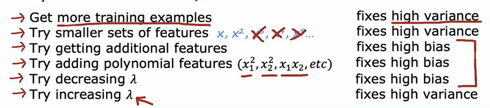
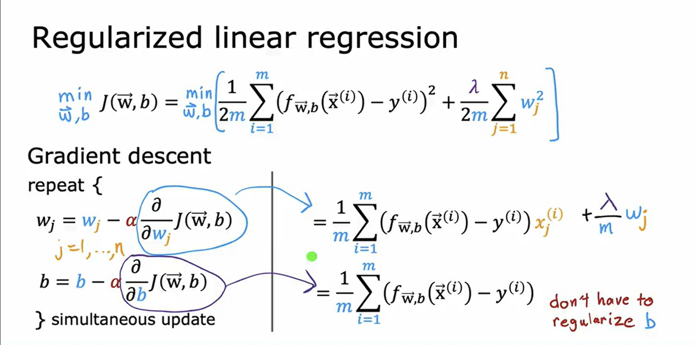
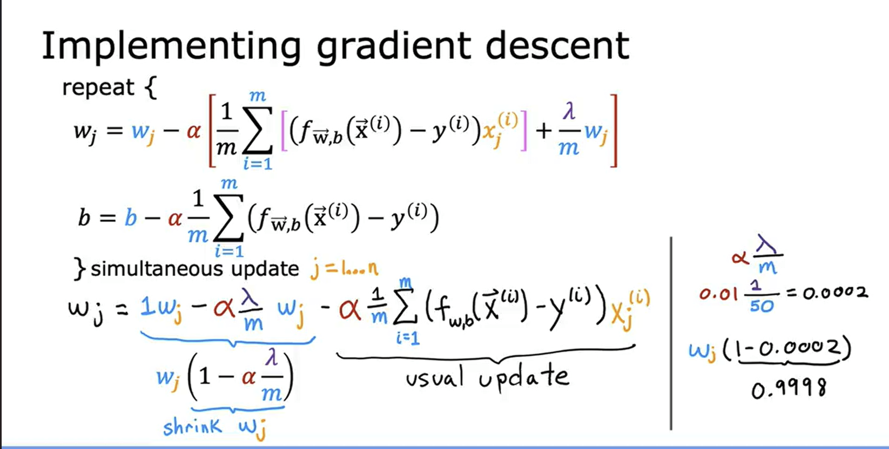

# Regularization & Bias–Variance Tradeoff

This note is a **concept refresher**, not a tutorial.
The goal is to remind you:
- why regularization exists
- what problem it solves
- what to care about while using it

---

## 1. Why Regularization Exists (Core Reason)

Regularization exists to solve **one fundamental problem**:

> **Models can fit training data too well and fail on new data.**

This problem is called **overfitting**.

When a model:
- learns noise
- memorizes training data
- becomes overly sensitive to small changes

it performs poorly on unseen data.

Regularization is a **controlled restriction** that prevents this behavior.

---

## 2. What Regularization Actually Does

Regularization works by **penalizing complexity**.

Instead of minimizing only loss:

\[
\text{Loss}
\]

we minimize:

\[
\text{Loss} + \lambda \times \text{Penalty}
\]

Where:
- **Loss** → data fit
- **Penalty** → model complexity
- **λ (lambda)** → strength of regularization

So the model is forced to ask:

> “Is this complexity really worth it?”

---

## 3. Bias–Variance Tradeoff (Mental Model)

Every model error comes from **two sources**:

### Bias
- Error from **wrong assumptions**
- Model is too simple
- Underfits data

Examples:
- Linear model for highly nonlinear data
- Strong regularization

---

### Variance
- Error from **too much sensitivity**
- Model is too complex
- Overfits data

Examples:
- High-degree polynomials
- No regularization

---

### The Tradeoff

| Increase | Effect |
|-------|-------|
| Model complexity | ↓ Bias, ↑ Variance |
| Regularization | ↑ Bias, ↓ Variance |

**You can’t minimize both simultaneously.**  
Regularization helps you **balance** them.

---

## 4. L2 Regularization (Ridge)

### What it penalizes
\[
\sum w^2
\]

### What it does intuitively
- Shrinks weights smoothly
- Keeps all features, but reduces their influence

### When to use
- When many features contribute a little
- When multicollinearity exists
- Default safe choice

---

## 5. L1 Regularization (Lasso)

### What it penalizes
\[
\sum |w|
\]

### What it does intuitively
- Pushes some weights to **exact zero**
- Performs feature selection

### When to use
- When you want sparse models
- When feature selection matters

---

## 6. Elastic Net (L1 + L2)

Combines:
- L1 → sparsity
- L2 → stability

Used when:
- Many correlated features
- You want balance, not extremes

---

## 7. What to Care About While Using Regularization

### 1. Regularization strength (λ)
- Too small → no effect (overfitting remains)
- Too large → underfitting

Always tune λ using **validation data**, not training data.

---

### 2. Feature scaling matters
- Especially for L1 and L2
- Unscaled features distort penalty

Standardization is not optional.

---

### 3. Training vs test performance
- Regularization may **increase training error**
- But should **decrease validation/test error**

That is expected and desired.

---

## 8. Quick Diagnostic Table

| Symptom | Likely Cause | Fix |
|------|-----------|-----|
| High train error | High bias | Reduce regularization |
| Low train, high test error | High variance | Increase regularization |
| Unstable weights | Multicollinearity | Use L2 |
| Too many useless features | Noise | Use L1 |

---

## 9. One-Line Takeaways

- Regularization exists to **control variance**
- It trades a bit of bias for better generalization
- L2 shrinks weights, L1 removes them
- Always tune λ on validation data

> **Regularization is not about making models worse — it’s about making them reliable.**

---

--- 
# Extra 

## Final Points That Complete This Topic

### 1. Regularization is a generalization tool, not a fitting tool
- Its goal is **not** to reduce training error
- Its goal is to reduce **validation / test error**

If regularization lowers training error, that is usually a warning sign.

---

### 2. Bias–Variance describes error sources, not models
Do not think:
> “Linear regression has high bias”

Think:
> “This configuration produces high bias”

Bias and variance depend on:
- model complexity
- regularization strength
- data size
- noise level

---

### 3. Regularization always moves you on the bias–variance curve
- Increasing λ → **higher bias, lower variance**
- Decreasing λ → **lower bias, higher variance**

You are not fixing a bug — you are **choosing a tradeoff**.

---

### 4. Validation error is the only signal that matters
- Training error → misleading
- Test error → too late
- Validation error → decision signal

Regularization strength **must be chosen using validation data**.

---

### 5. Feature scaling is not optional
Without scaling:
- L1 / L2 penalties lose meaning
- Some features get unfairly penalized
- Regularization behaves unpredictably

**Rule:**
> Regularization without feature scaling is conceptually broken.

---

### 6. Regularization is not the same as reducing features
- L2 → keeps all features, shrinks their influence
- L1 → removes some features entirely

Choose based on **desired behavior**, not habit.

---

### 7. More data and regularization solve the same problem differently
Both reduce variance:
- More data → reduces variance naturally
- Regularization → reduces variance artificially

If data is limited, regularization is critical.  
If data is abundant, reliance on regularization decreases.

---

### 8. Underfitting is also a failure
Too much regularization:
- destroys useful signal
- oversimplifies the model
- increases bias excessively

Regularization is a **dial**, not a switch.

---

### 9. Optimizers do not fix bias–variance
- Adam, Momentum, RMSProp → improve optimization
- Regularization → improves generalization

They solve **different problems**.

---

### 10. Final mental model

> Bias = wrong assumptions  
> Variance = overreaction to data  
> Regularization = controlled skepticism  

The model is told:
> “Do not trust the data too much unless it proves itself.”

---

### One-sentence closure

> **Bias–variance explains why models fail, and regularization is the primary tool used to control that failure.**

